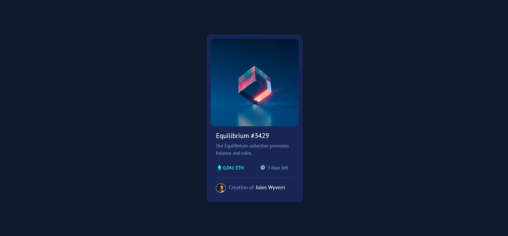

## Table of contents

- [Overview](#overview)
  - [The challenge](#the-challenge)
  - [Screenshot](#screenshot)
  - [Links](#links)
- [My process](#my-process)
  - [Built with](#built-with)
  - [Useful resources](#useful-resources)
- [Author](#author)

## Overview

### The challenge

Users should be able to:

- View the optimal layout depending on their device's screen size
- See hover states for interactive elements

### Screenshot

### Links

- Live Site URL: [NFT_Equilibrium](https://niladrisekhar8712.github.io/NFT_Equilibrium/)

## My process

### Built with

- Semantic HTML5 markup
- CSS custom properties
- Flexbox
- Bootstrap
- Google Font API

### Useful resources

- [Bootstrap Card](https://getbootstrap.com/docs/5.3/components/card/#about) - This helped me for structuring the overall skeleton of the project. I really liked this pattern and will use it going forward.

## Author
- Frontend Mentor - [@niladrisekhar8712](https://www.frontendmentor.io/profile/niladrisekhar8712)
